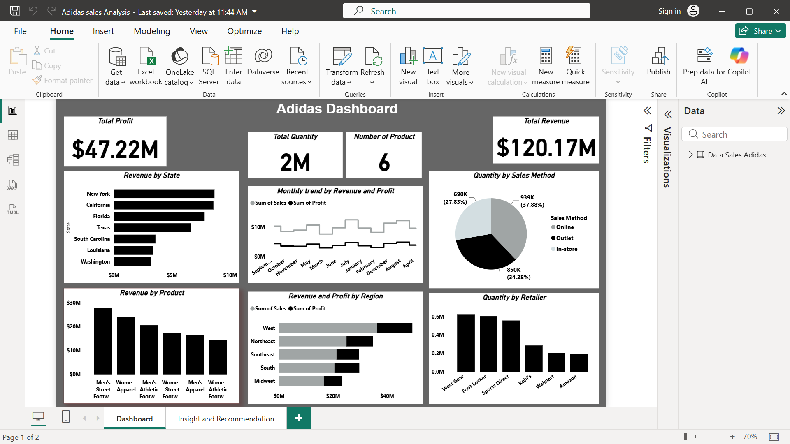

# Adidas Sales Analysis

A Power BI dashboard analyzing Adidas US sales performance across regions, product categories, retailers, and sales channels, with a written insights & recommendations page.

## Goal
Understand which regions, product categories, and sales channels drive the most revenue and profit for Adidas, and translate that into actionable recommendations.

## Tools
Power BI (Desktop)

## File
`Adidas_Sales_Analysis.pbix` — includes the data model, report pages, and visuals. Open directly in Power BI Desktop (free) to explore interactively.

## Report pages
1. **Dashboard** — KPI cards (Total Revenue, Total Quantity, Total Profit, Number of Products) plus:
   - Revenue and Profit by Region
   - Revenue by Product
   - Revenue by State
   - Monthly trend by Revenue and Profit
   - Quantity by Sales Method
   - Quantity by Retailer
2. **Insight and Recommendation** — written summary of findings

## Key insights
- Total revenue of **$120M** with **$46M** profit for the period analyzed.
- **Men's Street Footwear** and **Women's Apparel** were the top-performing categories by revenue and profit.
- The **West** region led in revenue and profit, followed by the Northeast; the **Midwest** lagged behind.
- Revenue peaked in **July**, while profit peaked in **August**.
- **Online and outlet channels** outperformed in-store purchases, reflecting a shift toward digital and discount shopping.

## Recommendations
- Run localized marketing and discount campaigns to lift Midwest sales; keep investing in the West and Northeast with exclusive launches and optimized inventory.
- Improve the online experience with loyalty programs and personalized offers; align major campaigns with the July–August peak.
- Keep focus on top categories while developing emerging product lines through innovation and collaborations.

## Preview

## Data source
Public Adidas US sales dataset (commonly used for BI/analytics practice — retailer, region, and product-level sales data, no customer-level information).
